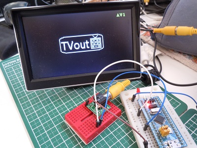
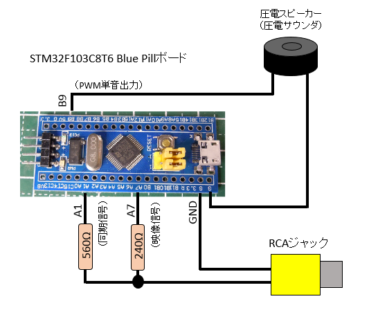

# Arduino STM32 TVoutライブラリ

  

## 概要
Arduino STM32環境にて利用可能なNTSCビデオ出力ライブラリです.  
STM32F103x系マイコン搭載ボードにてNTSCビデオ出力を行うことが出来ます.  
[Arduino(ATmega328)版 ビデオ出力ライブラリTVout](https://github.com/Avamander/arduino-tvout/)と互換性の高いAPIを有します.  

**(注意)**  
・本ライブラリには[ArduinoSTM32_TNTSC](https://github.com/Tamakichi/ArduinoSTM32_TNTSC)の上位レイアのライブラリです.  
・描画処理を行うには別途下位のライブラリ**ArduinoSTM32_TNTSC**必要となります。  
・フォントは含まれていません.Arduino(ATmega328)版 TVoutライブラリ付属のTVoutfontsのインストールが必要です.  

## ライブラリ名称
TTVout (ヘッダーファイル TTvout.h)  

## 仕様
- NTSCモノクロ2色(白・黒)表示  
- 表示解像度 5つのモード  
 横112×縦108ドット ～ 横448×縦216ドット  
- ビデオ出力には下記リソースを利用します.  
 - SRAM ビデオ表示用フレームバッファ 1,512～12,096バイト(解像度による)  
 - タイマー Timer2  
 - SPI1  
 - DMA1 CH3
- 単音出力に下記リソースを利用します.
 - タイマー Timer4
 
## 回路図  
  
接続端子  
PA1: 同期信号  
PA7: 映像信号  
PB9: PWM単音信号  

## インストール  
- [ArduinoSTM32_TNTSC](https://github.com/Tamakichi/ArduinoSTM32_TNTSC)を別途インストールする.  
- [Arduino(ATmega328)版 ビデオ出力ライブラリTVout](https://github.com/Avamander/arduino-tvout/)をインストールする.  
  だだし利用するのはTVoutfontsのみ.  
- TTVoutフォルダを各自のArduino STM32インストール先のライブラリ用フォルダに配置する.  
  (インストールフォルダ\hardware\Arduino_STM32\STM32F1\libraries\ に配置)  
- Arduino(ATmega328)版 TVoutを別途インストール

## オリジナルTVoutとの非互換部分
- PAL形式は未サポートです.  
- 解像度およびその指定方法が異なります.begin()関数にて次の解像度を指定します.    

 システムクロック 72MHz時  
 
 mode|横ドット数|縦ドット数|使用メモリサイズ(バイト)
 :---:|--------:|--------:|---------------------:|
 SC_112x108|112|108|1,512
 SC_224x108|224|108|3,024
 SC_224x216|224|216|6,048
 SC_448x108|448|108|6,048
 SC_448x216|448|216|12,096

 システムクロック 48MHz時  
 
 mode|横ドット数|縦ドット数|使用メモリサイズ(バイト)
 :---:|--------:|--------:|---------------------:|
 SC_128x96|128|96|1,536
 SC_256x96|256|96|3,072
 SC_256x192|256|192|6,144
 SC_512x96|512|96|6,144
 SC_512x192|512|192|12,288
 SC_128x108|128|108|1,728
 SC_256x108|256|108|3,456
 SC_256x216|256|216|6,912
 SC_512x108|512|108|6,912
 SC_512x216|512|216|13,824

- 次のAPIは未対応です.
 - void force_vscale(char sfactor);  
 - void force_outstart(uint8_t time);  
 - void force_linestart(uint8_t line);  
 - void set_vbi_hook(void (*func)());  
 - void set_hbi_hook(void (*func)());  

- 描画関数の座標指定の引数の型はuint16_tからint16_tに変更しています.
